# 前置准备

1. 已安装好 **ENVI 5.3**。
2. 已有打标完成的 xml 文件。
3. **确保与本流程相关的文件位置不存在中文路径**。

---

# xml 标签转 tif mask

- 这里的过程我们以 ==SW-农作物分类数据集== 为例。

### 预处理

- 首先打开 ENVI 软件，将遥感图像和 .xml 标签文件拖入其中。

- 将遥感图像进行裁剪，
  `(注意：裁剪的过程是必要的，21年的GF1遥感图像可能存在某些问题，若未裁剪直接导出 mask 会发生错误)`

  选择 ==文件--另存为--另存为 ...(ENVI, NITF, TIFF, DTED)== 。
  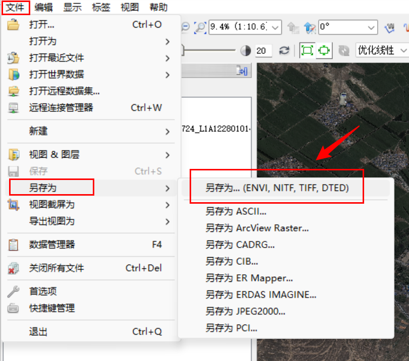

- 选中刚刚导入的遥感图像，点击空间裁剪，在右侧的遥感图像缩略图上框选出标签所在的大致区域，然后确定。
  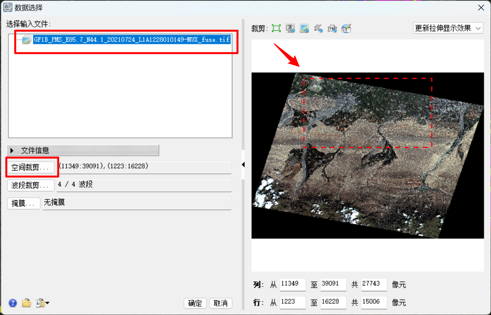
- 输出格式选择TIFF，选择合适的路径输出，耐心等待片刻，注意右下角的进度条，读条未结束时不要进行下一步操作。
  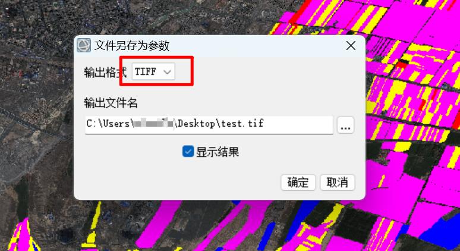

### 生成 mask 掩码图像

- 下图是裁剪完成后的结果，
  接着在右侧搜索框中搜索 ==ROI== ，选择 ==从 ROI 创建分类图像== 。
  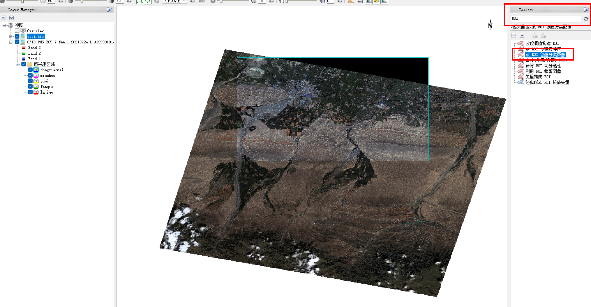

- 选中刚刚切割出的遥感图像，点击确定。
  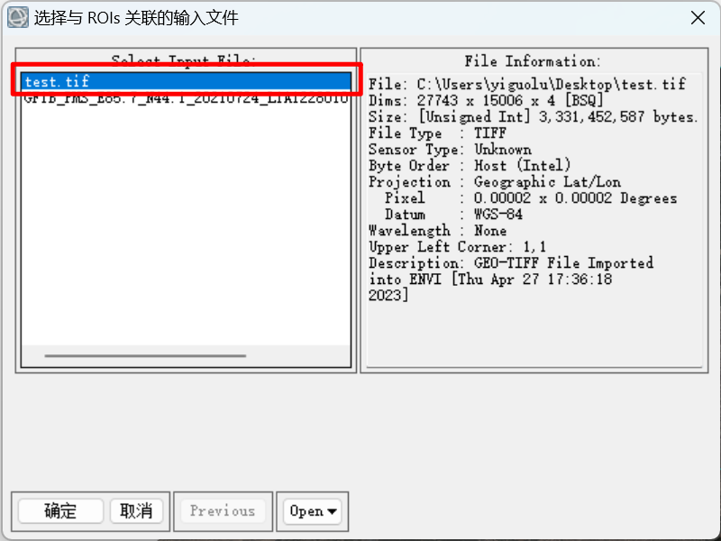

- 选中需要创建 mask 的标签，这里我们直接全选即可。
  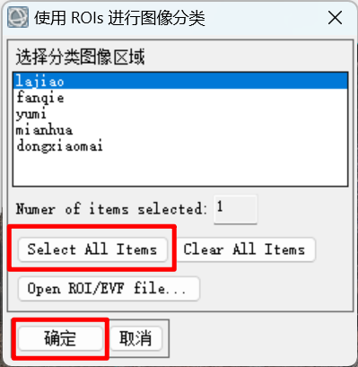

- **类值参数按照之前逻辑图中定好的数值设置**，如:逻辑图中标注 ==01-冬小麦== ，==dongxiaomai== 的类值就设为1，这里因为标签中不存在春小麦，故将后面几类的类值向前挪一位。

  设定好类值后，选择合适的输出文件路径，点击确定，随后耐心等待，注意观察右下角是否还有进度条。
  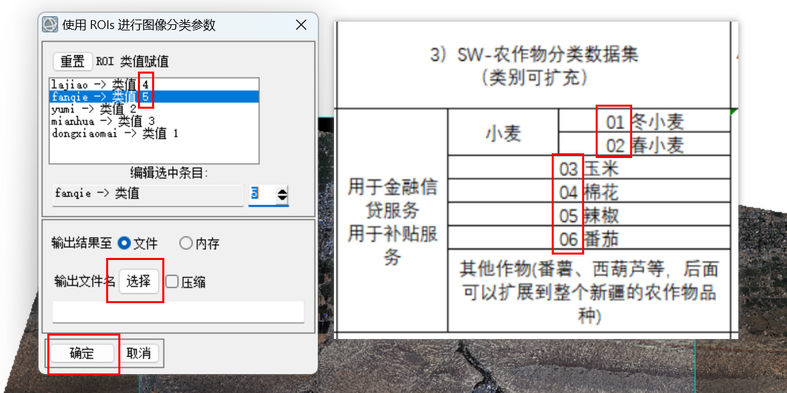

### 裁剪

`注意：这一步也是必要的，未裁剪直接导出的图像为三通道mask，裁剪时直接选择裁剪为TIFF格式才能生成单通道mask`

- 下图是裁剪后的遥感图像和生成的 mask 掩码图像，可以看到仍然存在大量的无标签区域，此时我们需要对标签做进一步裁剪。
  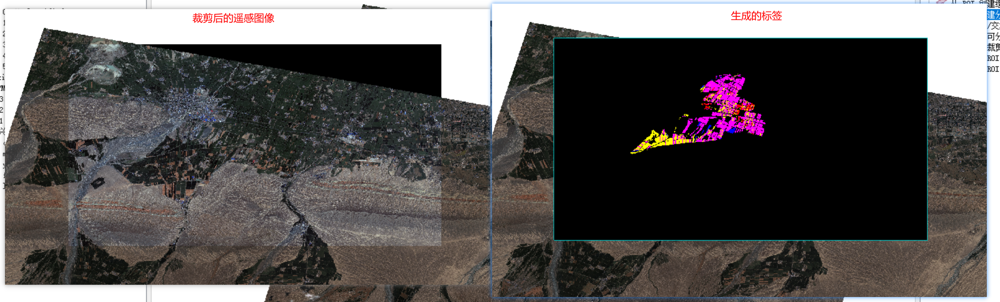

- 裁剪过程和之前一样，选择 ==文件--另存为--另存为 ...(ENVI, NITF, TIFF, DTED)== ，选中刚刚生成的 mask 掩码图像，点击 ==空间裁剪== 选中标签所在的区域。

  此时需要注意，裁剪完 mask 后我们需要对生成这张 mask 的原图也就是 test.tif 做同样的裁剪，以便于 mask 与原图对应，因此我们需要**将裁剪的区域参数记下**。
  

- 输出格式我们选择 TIFF，这将作为最终输出的 mask 标签图片供下一步分割使用，
  确定后耐心等待，同样注意观察右下角进度条。
  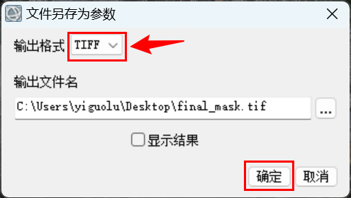

- 最后裁剪原图，这里的原图指的是用于生成mask的图片，也就是我们之前裁剪后生成的 test.tif 图片。

  将参数调整为与裁剪 mask 时一致，点击确定。
  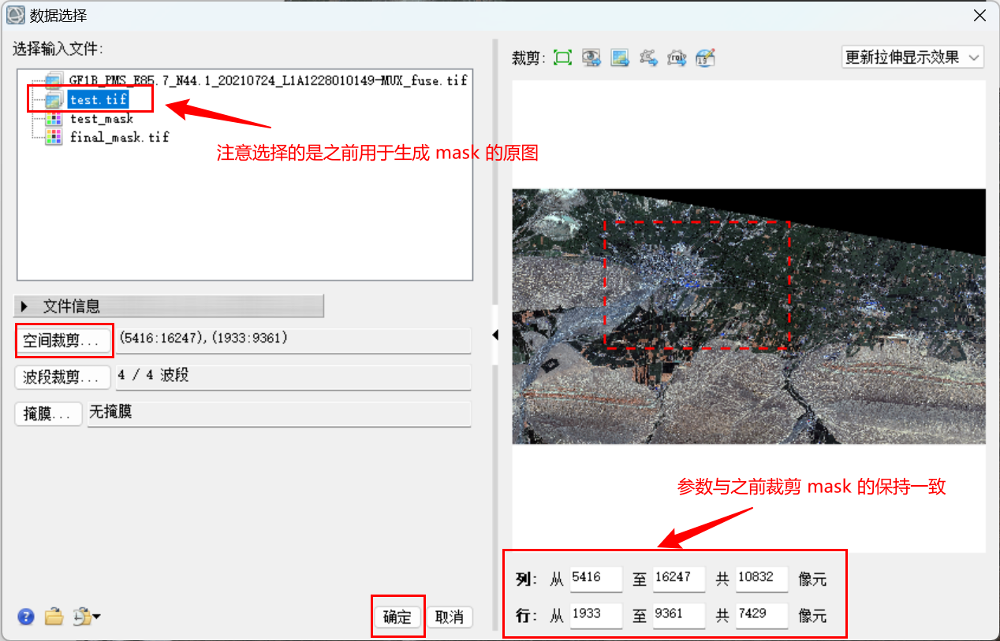

- 同样选择 TIFF 格式输出，选择合适路径，确定后耐心等待，注意观察右下角进度条。
  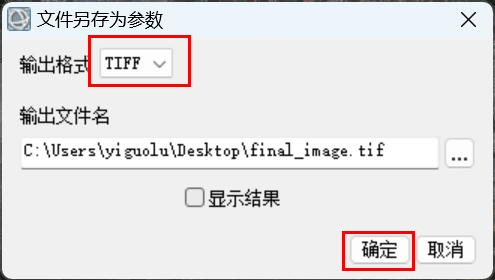

- 最后在输出的路径下可以看到有最终的 ==原图== 和 ==标签== 两个 .tif 文件。
  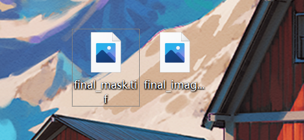

- 将它们用Windows自带的照片打开后分别是这样，照片无法显示4波段遥感图像：
  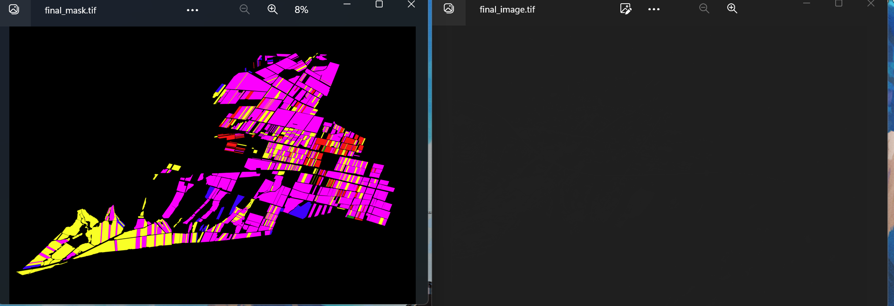

- 用envi打开后可以看到图像的本来面目。
  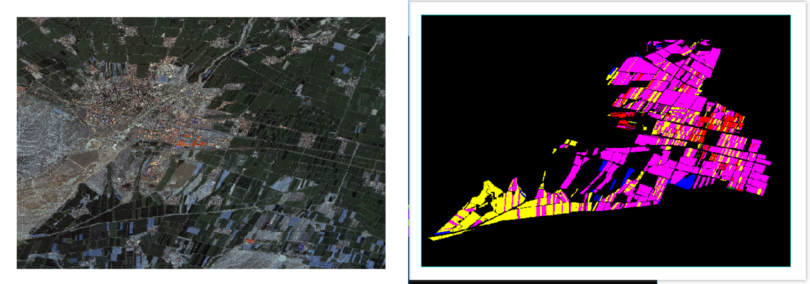

> 这样一来就生成了 tif 标签和与标签对应的 tif 原图了，接下来需要对它们进行下一步[处理](#tif图像处理)。

### 关于重叠标签的问题

#### 结论

**在envi中, 上方标签值可覆盖下方标签值。**

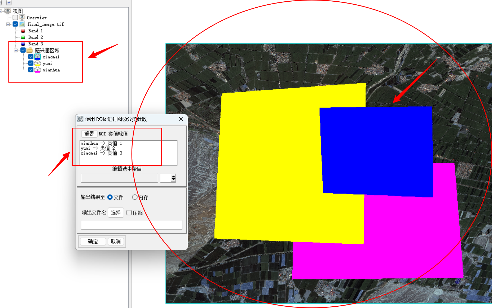

#### 验证

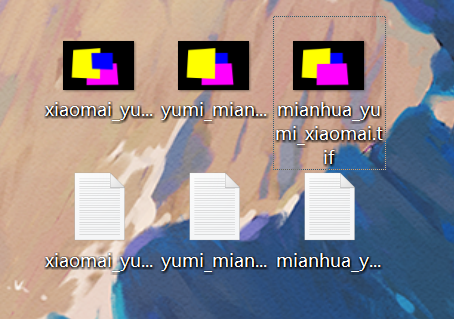

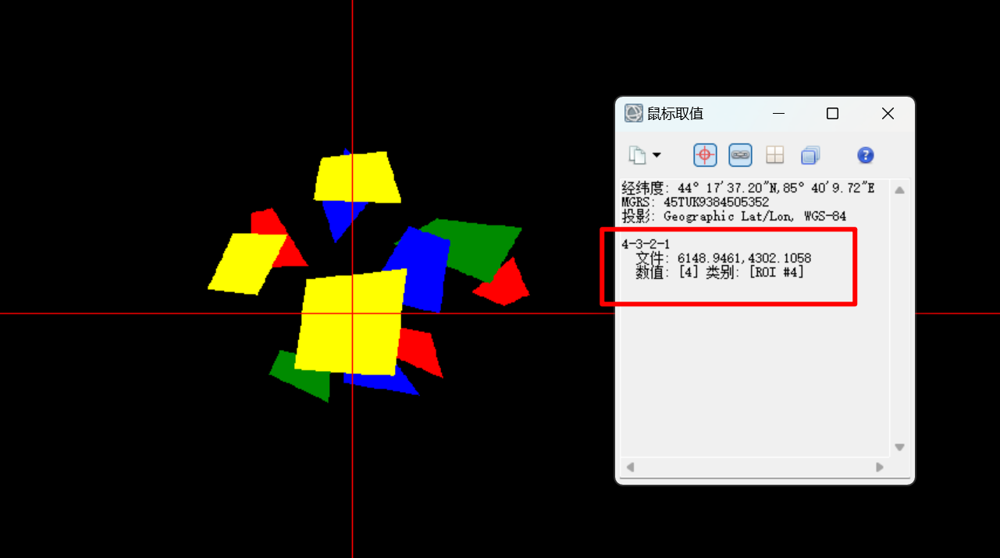

---

# tif图像处理

我已经将处理全流程的代码上传至GitHub，大家可以自行下载

 [shawan_DataProcess (GitHub地址)](https://github.com/lyg2021/shawan_DataProcess) 

需要的包:

```bash
pip install numpy, rasterio
```

### tif 图片切割

1. 将上一步得到的 tif 原图和 tif 标签放到 `shawan_DataProcess` 目录下。

2. 配置 `shawan_DataProcess/tif_split_to_tif.py` 

   ```python
   if __name__ == "__main__":
       # 输入路径
       big_tif_image_path = "final_image.tif"
       big_tif_mask_path = "final_mask.tif"
   
       # 图片裁剪尺寸
       crop_size = (256, 256)
       
       # 图片裁剪步长
       stride = 128
   
       main(big_tif_image_path=big_tif_image_path,     # 原图路径
            big_tif_mask_path=big_tif_mask_path,       # 标签路径
            crop_size=crop_size,                       # 裁剪尺寸
            stride=stride)                             # 裁剪步长
   ```

   修改输入路径，并设置需要的裁剪尺寸和裁剪步长。

3. 运行后会在当前目录下得到两个文件夹，文件夹下分别是裁剪后的原图和标签。

### 数据集清洗

此时得到的mask图片中可能存在标签占比极低甚至没有的情况，需要对这些数据进行清洗，删除这些劣质标签和其对应的原图。

1. 配置 `shawan_DataProcess/labelCleaning.py` 
   ```python
   if __name__ == "__main__":
   
       # 输入路径
       image_path = "images_256"
       mask_path = "masks_256"
   
       # 含0量超过这个比例就删了这标签
       percentage = 0.95
   
       main(image_path=image_path, mask_path=mask_path, percentage=percentage)
   ```

   修改输入路径，设置清洗阈值，percentage 代表背景像素占整张图的比重，若背景占比含量超标，则删除。

2. 运行。

### 重命名

命名太单一不利于后续加入新的训练数据,  所以要求大家命名为210724-02-1 至210724-02-N。

  ==(命名规则：这张图的时间-分辨率-图片序号)==,   分辨率指遥感图像的空间分辨率, 02 代表 2m 的空间分辨率。

  裁剪的尺寸可在数据集文件夹上注明。

1. 配置 `shawan_DataProcess/rename.py` 
   ```python
   if __name__ == "__main__":
       """
       只适用于一级目录
       """
   
       dir_path1 = "images_256"
       dir_path2 = "masks_256"
   
       new_first_name = "210724-02"
       suffix_name = ".tif"
   
       rename(dir_path=dir_path1, new_first_name=new_first_name, suffix_name=suffix_name)
       rename(dir_path=dir_path2, new_first_name=new_first_name, suffix_name=suffix_name)
   ```

   修改输入路径，`new_first_name` 为命名规则的固定部分，`suffix_name` 为文件扩展名。

2. 运行。

### 目录重组

如果使用 `mmsegmentation` 进行训练和测试，需要对目录进行重组，形式为:
```bash
├── data
│   ├── my_dataset
│   │   ├── img_dir
│   │   │   ├── train
│   │   │   │   ├── xxx{img_suffix}
│   │   │   │   ├── yyy{img_suffix}
│   │   │   │   ├── zzz{img_suffix}
│   │   │   ├── val
│   │   ├── ann_dir
│   │   │   ├── train
│   │   │   │   ├── xxx{seg_map_suffix}
│   │   │   │   ├── yyy{seg_map_suffix}
│   │   │   │   ├── zzz{seg_map_suffix}
│   │   │   ├── val
```

1. 配置 `shawan_DataProcess/allot.py` 
   ```
   if __name__ == "__main__":
       # 输入路径
       image_path = r"images_256"
       mask_path = r"masks_256"
   
       # 训练集的百分比
       train_percentage = 0.6
   
       # 输出的数据集根目录
       dataset_root = r"shawan_4fenlei_256"
   
       path_list = make_dir(dataset_root=dataset_root)
   
       allot(image_path=image_path,    # 原图路径
             mask_path=mask_path,      # 标签路径
             train_percentage=train_percentage,    # 训练集百分比
             path_list=path_list)      # 输出路径列表(固定的)
   ```

   修改输入路径，设置训练集占比，修改输出路径。

2. 运行。

---

# 模型代码配置

这里使用 `mmsegmentation` 进行训练和测试，

以下内容参考 [MMSegmentation官方文档](https://mmsegmentation.readthedocs.io/zh_CN/latest/) 。

### mmsegmentation 安装

按照官方文档教程即可

 [开始：安装和运行 MMSeg — MMSegmentation 1.0.0 文档](https://mmsegmentation.readthedocs.io/zh_CN/latest/get_started.html) 

### 用自己的数据集训练

#### 导入数据集

在 `mmsegmentation` 目录下新建 `data` 文件夹，把上一步得到的数据集放到该文件夹下。

#### 数据集配置文件

1. 在 `mmsegmentation/mmseg/datasets` 路径下新建一个 `shawan_nongzuowu_256.py` 

   ```python
   # Copyright (c) OpenMMLab. All rights reserved.
   from mmseg.registry import DATASETS
   from .basesegdataset import BaseSegDataset
   
   
   @DATASETS.register_module()
   class ShawanNongzuowu256Dataset(BaseSegDataset):
       """shawan dataset
       """
       METAINFO = dict(
           classes=('background', 'lajiao', 'fanqie', 'yumi', 'mianhua', 'dongxiaomai',),
           palette=[[255, 255, 255], [255, 0, 0], [255, 255, 0], [0, 0, 255],
                    [159, 129, 183], [0, 255, 0]])
   
       def __init__(self,
                    img_suffix='.tif',
                    seg_map_suffix='.tif',
                    reduce_zero_label=False,
                    **kwargs) -> None:
           super().__init__(
               img_suffix=img_suffix,
               seg_map_suffix=seg_map_suffix,
               reduce_zero_label=reduce_zero_label,
               **kwargs)
   ```

   ` classes` 的顺序按照类别像素值从 0 ~ N 的顺序，例如 `background` 对应像素值 `0` , `lajiao` 对应像素值 `1` ，以此类推。

   `palette` 为调色板，将 0 ~ N 的像素值映射为多种颜色，便于可视化，其数量应与 `classes` 数量对应。

   `img_suffix `和 `seg_map_suffix` 分别为原图和标签图的扩展名。

   `reduce_zero_label` 表示是否忽略像素值为 `0` 的区域，这里我们将它设为 `False` ，因为像素值为 `0` 的区域作为 `background` 也参与计算。

2. 在 `mmsegmentation/mmseg/datasets/__init__.py` 中将类别进行注册
   ```python
   ...
   from .shawan_nongzuowu_256 import ShawanNongzuowu256Dataset
   
   __all__ = [
       ..., 'Shawan4Fenlei256Dataset'
   ]
   ```

3. 在 `mmsegmentation/configs/_base_/datasets/` 路径下新建一个 `shawan_nongzuowu_256.py` 
   ```python
   # dataset settings
   dataset_type = 'ShawanNongzuowu256Dataset'
   data_root = 'data/shawan_nongzuowu_256'
   crop_size = (256, 256)
   train_pipeline = [
       dict(type='LoadImageFromFile'),
       dict(type='LoadAnnotations', reduce_zero_label=False),
       dict(
           type='RandomResize',
           scale=(2048, 512),
           ratio_range=(0.5, 2.0),
           keep_ratio=True),
       dict(type='RandomCrop', crop_size=crop_size, cat_max_ratio=0.75),
       dict(type='RandomFlip', prob=0.5),
       dict(type='PhotoMetricDistortion'),
       dict(type='PackSegInputs')
   ]
   test_pipeline = [
       dict(type='LoadImageFromFile'),
       dict(type='Resize', scale=(256, 256), keep_ratio=True),
       # add loading annotation after ``Resize`` because ground truth
       # does not need to do resize data transform
       dict(type='LoadAnnotations', reduce_zero_label=False),
       dict(type='PackSegInputs')
   ]
   img_ratios = [0.5, 0.75, 1.0, 1.25, 1.5, 1.75]
   tta_pipeline = [
       dict(type='LoadImageFromFile', backend_args=None),
       dict(
           type='TestTimeAug',
           transforms=[
               [
                   dict(type='Resize', scale_factor=r, keep_ratio=True)
                   for r in img_ratios
               ],
               [
                   dict(type='RandomFlip', prob=0., direction='horizontal'),
                   dict(type='RandomFlip', prob=1., direction='horizontal')
               ], [dict(type='LoadAnnotations')], [dict(type='PackSegInputs')]
           ])
   ]
   train_dataloader = dict(
       batch_size=4,
       num_workers=4,
       persistent_workers=True,
       sampler=dict(type='InfiniteSampler', shuffle=True),
       dataset=dict(
           type=dataset_type,
           data_root=data_root,
           data_prefix=dict(
               img_path='img_dir/train', seg_map_path='ann_dir/train'),
           pipeline=train_pipeline))
   val_dataloader = dict(
       batch_size=1,
       num_workers=4,
       persistent_workers=True,
       sampler=dict(type='DefaultSampler', shuffle=False),
       dataset=dict(
           type=dataset_type,
           data_root=data_root,
           data_prefix=dict(img_path='img_dir/val', seg_map_path='ann_dir/val'),
           pipeline=test_pipeline))
   test_dataloader = val_dataloader
   
   val_evaluator = dict(type='IoUMetric', iou_metrics=['mIoU'])
   test_evaluator = val_evaluator
   
   ```

   注意修改:

   -  `dataset_type` 为第1步建立的数据集类名;
   -  `data_root` 为数据集所在路径;
   -  `crop_size` 为图片输入模型时的尺寸;
   - 注意将 `reduce_zero_label` 都设为 `False` ，在该文件中共两处，可以 `Ctrl + F` 查找;
   -  `test_pipeline` 中的 `scale` 值设为与数据集原图大小一致。

至此，数据集配置文件已经完成。

#### 训练配置文件

训练时需调用训练配置文件，以 `deeplabv3plus` 为例，在 `mmsegmentation/configs/deeplabv3plus`  下新建文件 `deeplabv3plus_r50-d8_4xb4-80k_shawan_nongzuowu_256-256x256.py` 

文件命名规则为 `模型名称_主干网络名称_训练轮次_数据集名称_输入图片大小` 

```python
_base_ = [
    '../_base_/models/deeplabv3plus_r50-d8.py', '../_base_/datasets/shawan_nongzuowu_256.py',
    '../_base_/default_runtime.py', '../_base_/schedules/schedule_80k.py'
]
crop_size = (256, 256)
data_preprocessor = dict(size=crop_size)
model = dict(
    data_preprocessor=data_preprocessor,
    decode_head=dict(num_classes=6),
    auxiliary_head=dict(num_classes=6))

train_dataloader = dict(batch_size=4)
```

` '../_base_/datasets/shawan_nongzuowu_256.py'` 为数据集配置文件路径。

 `crop_size` 为图片输入模型时的尺寸。

 `num_class` 设为与当前数据集一致数量应加上背景类。

 `batch_size` 可根据实验需要进行调整。

#### 其他配置

##### 打开 tensorboard

[TensorBoard 的配置](https://mmsegmentation.readthedocs.io/zh_CN/latest/user_guides/visualization.html#tensorboard)  

##### 设置保存最佳权重模型

在 `configs/_base_/schedules` 下，以 `schedule_80k.py` 为例

```
default_hooks = dict(
    timer=dict(type='IterTimerHook'),
    logger=dict(type='LoggerHook', interval=50, log_metric_by_epoch=False),
    param_scheduler=dict(type='ParamSchedulerHook'),
    checkpoint=dict(type='CheckpointHook',
                    save_best="mIoU",           ## 搁这加
                    by_epoch=False, interval=8000),
    sampler_seed=dict(type='DistSamplerSeedHook'),
    visualization=dict(type='SegVisualizationHook'))
```

在 `default_hooks` 中的 `checkpoint` 中添加 `save_best="mIoU"` 。

#### 开始训练

进入到 `mmsegmentation` 根目录下，输入命令

  ```bash
  python tools/train.py configs/deeplabv3plus/deeplabv3plus_r50-d8_4xb4-80k_shawan_nongzuowu_256-256x256.py
  ```

其中 `configs/deeplabv3plus/deeplabv3plus_r50-d8_4xb4-80k_shawan_nongzuowu_256-256x256.py` 为 [训练配置文件](#训练配置文件) 路径。

详见 [教程4：使用现有模型进行训练和测试 — MMSegmentation 1.0.0 文档](https://mmsegmentation.readthedocs.io/zh_CN/latest/user_guides/4_train_test.html#id2) 。

---

==至此，为从 xml 到输入模型训练。==

